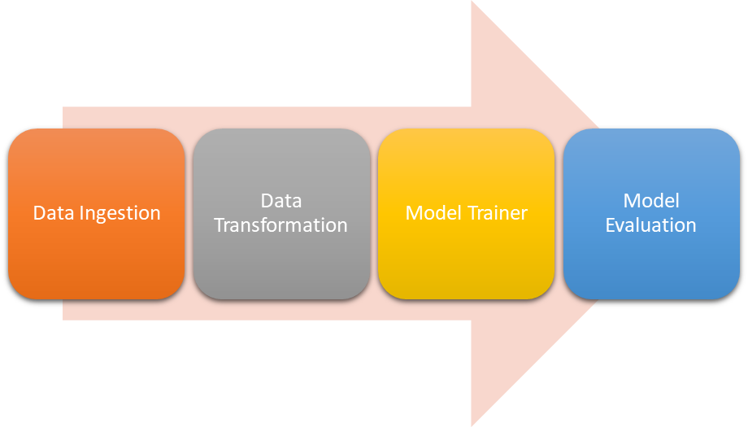

# ML Project for Evaluating the Best Model README

## Description:

This repository comprises the code for data pipelines and model training in a machine learning project. The system is designed to ingest data, perform data transformation and feature engineering, train a model, and evaluate the model's performance.

## System Architecture:



The system architecture is structured as follows:

- **Data Ingestion:** Data is ingested from a source (e.g., database, CSV file) and loaded into a data pipeline.

- **Data Transformation:** The data undergoes transformation into a format suitable for model training. This may involve tasks such as cleaning, normalization, and scaling.

- **Feature Engineering:** Features are extracted from the data to be utilized in training the model.

- **Model Training:** The data is used to train a machine learning model. The specific model architecture employed depends on the task.

- **Model Evaluation:** The trained model is evaluated on a test dataset to assess its performance.

## Pipelines:

The pipelines are designed to be modular and scalable.

## Models:

The models are implemented using Sci-kit Learn. The specific model architecture will vary based on the task.

## Evaluation:

The models are evaluated using accuracy.

## Getting Started:

To initiate this project, follow these steps:

1. **Install the required dependencies.**
2. **Configure the pipelines and models.**
3. **Run the pipelines to train and evaluate the models.**

## Dependencies:

The following dependencies are necessary to run this project:

- numpy
- pandas
- python-dotenv
- mysql-connector-python
- pymysql
- scikit-learn
- seaborn
- catboost
- xgboost
- Flask
- dill
- mlflow

## Running the Pipelines:

Execute the pipelines using the following commands:

```bash
python app.py
```

I hope this helps! Feel free to reach out if you have any further questions or concerns.